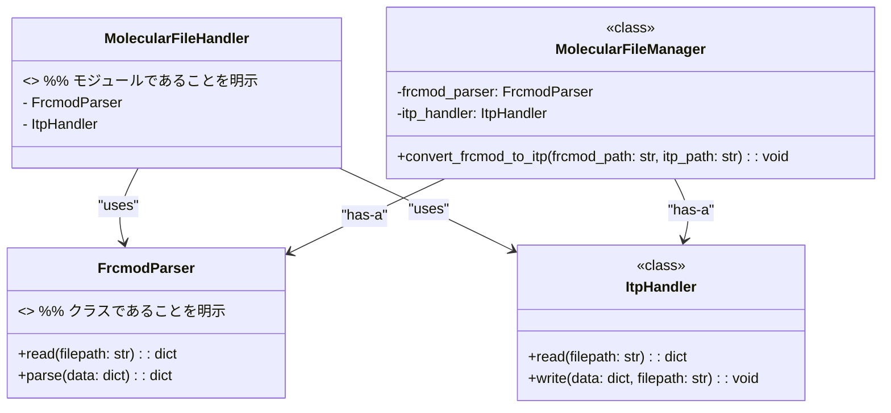

# temporary

```mermaid
classDiagram
    %% モジュールの表現（1つの大きな枠で囲む）
    class MolecularFileHandler {
        <<module>>  %% モジュールであることを明示
        - FrcmodParser
        - ItpHandler
    }

    %% クラス1: FrcmodParser
    class FrcmodParser {
        <<class>>  %% クラスであることを明示
        +read(filepath: str): dict
        +parse(data: dict): dict
    }

    %% クラス2: ItpHandler
    class ItpHandler {
        <<class>>
        +read(filepath: str): dict
        +write(data: dict, filepath: str): void
    }

    %% メインクラス: MolecularFileManager
    class MolecularFileManager {
        <<class>>
        +convert_frcmod_to_itp(frcmod_path: str, itp_path: str): void
        -frcmod_parser: FrcmodParser
        -itp_handler: ItpHandler
    }

    %% 関係性を表現する
    MolecularFileHandler --> FrcmodParser : "uses"
    MolecularFileHandler --> ItpHandler : "uses"
    MolecularFileManager --> FrcmodParser : "has-a"
    MolecularFileManager --> ItpHandler : "has-a"
```
