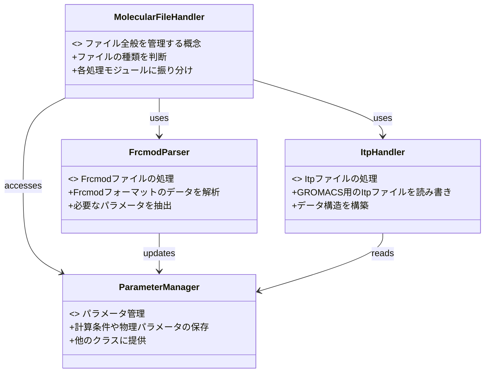

```mermaid
classDiagram
    %% 概念クラス図の要素
    class MolecularFileHandler {
        <<Concept>> ファイル全般を管理する概念
        +ファイルの種類を判断
        +各処理モジュールに振り分け
    }
    class FrcmodParser {
        <<Concept>> Frcmodファイルの処理
        +Frcmodフォーマットのデータを解析
        +必要なパラメータを抽出
    }
    class ItpHandler {
        <<Concept>> Itpファイルの処理
        +GROMACS用のItpファイルを読み書き
        +データ構造を構築
    }
    class ParameterManager {
        <<Concept>> パラメータ管理
        +計算条件や物理パラメータの保存
        +他のクラスに提供
    }

    %% クラス間の関係性を記述
    MolecularFileHandler --> FrcmodParser : uses
    MolecularFileHandler --> ItpHandler : uses
    MolecularFileHandler --> ParameterManager : accesses
    FrcmodParser --> ParameterManager : updates
    ItpHandler --> ParameterManager : reads
```
